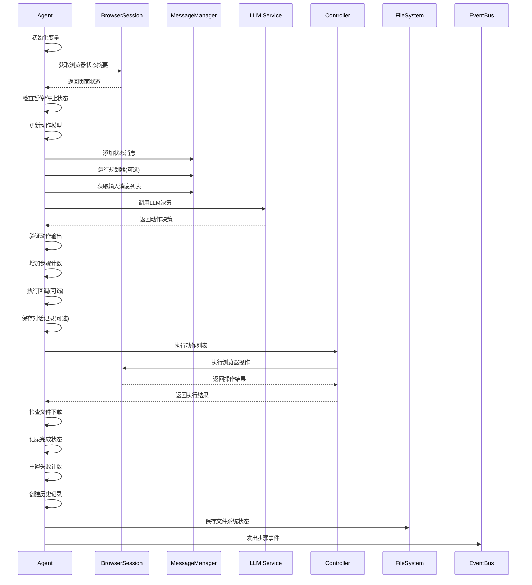
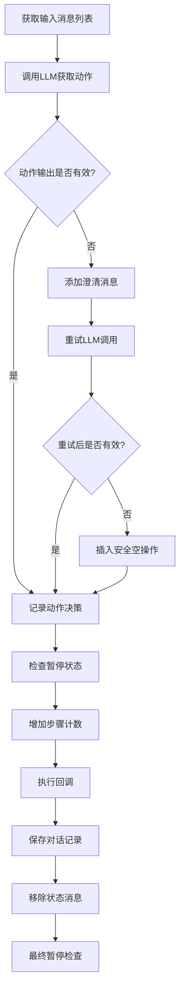
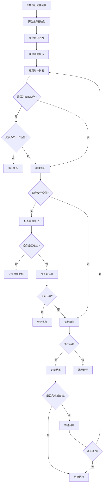
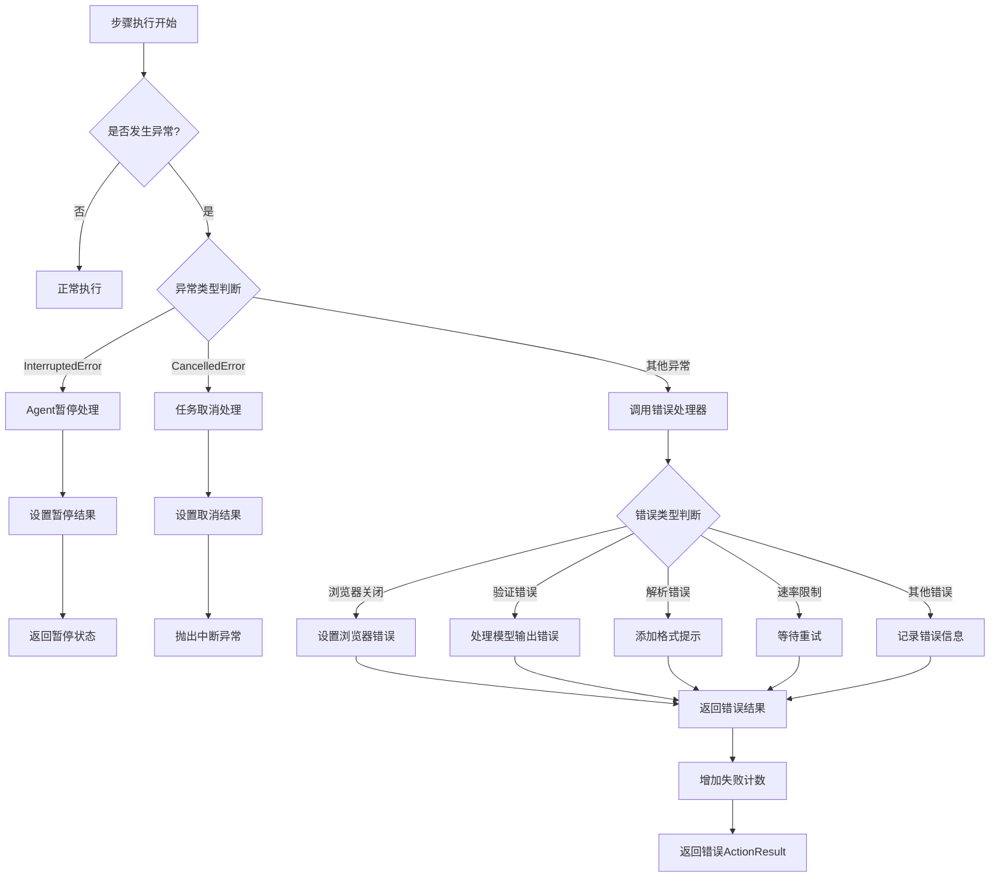
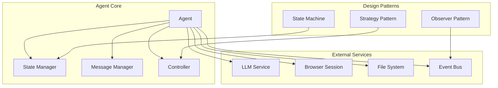
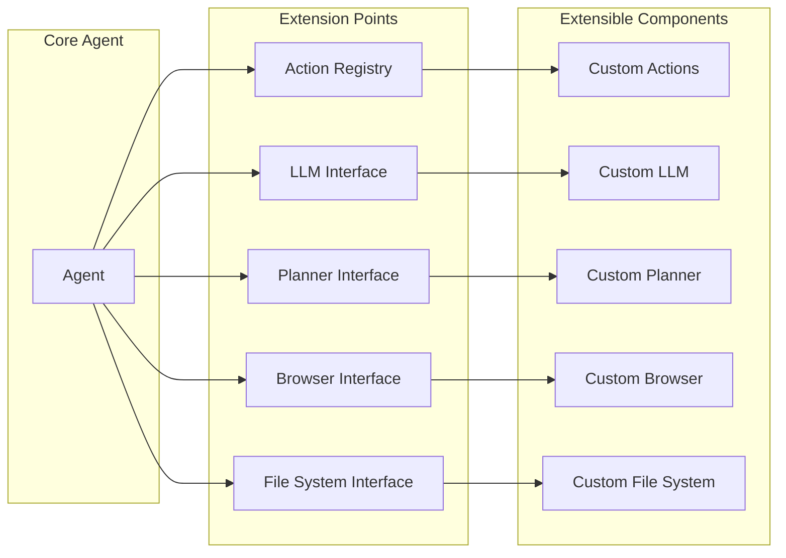
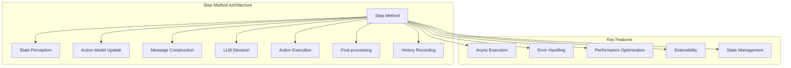

# Browser-Use Agent `step` 方法概览文档

## 方法概述

`step` 方法是 Browser-Use Agent 的核心执行方法，负责执行任务的单个步骤。它实现了完整的感知-决策-执行循环，是 AI 驱动的浏览器自动化的核心引擎。

## 方法签名

```python
@time_execution_async('--step')
async def step(self, step_info: AgentStepInfo | None = None) -> None:
```

## 核心流程架构

### 主干流程时序图



### 1. 初始化阶段

#### 职责说明
初始化阶段负责为当前步骤的执行准备必要的变量和状态，确保执行环境的清洁和一致性。

#### 为什么需要这个步骤？
1. **状态隔离**：每个步骤都需要独立的状态空间，避免状态污染
2. **性能监控**：记录执行时间，用于性能分析和优化
3. **错误恢复**：提供清晰的初始状态，便于错误定位和恢复
4. **内存管理**：明确变量生命周期，避免内存泄漏

#### 如果没有这个步骤会怎样？
- **状态混乱**：不同步骤间的状态可能相互干扰
- **性能问题**：无法准确监控步骤执行时间
- **调试困难**：错误发生时难以确定初始状态
- **内存泄漏**：变量可能累积导致内存问题

```python
# 变量初始化
browser_state_summary = None
model_output = None
result: list[ActionResult] = []
step_start_time = time.time()
```

### 2. 状态感知阶段 (State Perception)

#### 职责说明
状态感知阶段负责获取当前浏览器页面的完整状态信息，为后续的决策和执行提供准确的环境感知。

#### 为什么需要这个步骤？
1. **环境感知**：AI 代理需要了解当前页面的状态才能做出正确决策
2. **元素定位**：获取可交互元素信息，为动作执行提供目标
3. **状态同步**：确保 Agent 状态与浏览器状态保持一致
4. **用户控制**：检查用户是否暂停或停止操作
5. **性能优化**：缓存元素哈希值，避免重复计算

#### 如果没有这个步骤会怎样？
- **决策错误**：LLM 无法了解当前页面状态，可能做出错误决策
- **动作失败**：无法找到正确的元素，导致点击、输入等操作失败
- **状态不一致**：Agent 认为的页面状态与实际不符
- **无法响应**：无法检测到用户的暂停/停止指令
- **性能下降**：每次都需要重新计算元素信息

```python
# 获取浏览器状态摘要
browser_state_summary = await self.browser_session.get_state_summary(
    cache_clickable_elements_hashes=True
)
current_page = await self.browser_session.get_current_page()

# 记录步骤上下文
self._log_step_context(current_page, browser_state_summary)

# 检查暂停/停止状态
await self._raise_if_stopped_or_paused()
```

**关键功能：**
- 获取当前页面的完整状态信息（URL、标题、可交互元素、截图等）
- 缓存可点击元素的哈希值以提高性能
- 记录步骤上下文信息用于调试

### 3. 动作模型更新阶段 (Action Model Update)

#### 职责说明
动作模型更新阶段负责根据当前页面状态动态调整可用的动作列表，确保 LLM 能够获得最相关和可执行的动作选项。

#### 为什么需要这个步骤？
1. **上下文相关**：不同页面有不同的可执行动作，需要动态调整
2. **减少噪音**：过滤掉当前页面不可用的动作，提高决策准确性
3. **提高效率**：避免 LLM 选择无效动作，减少执行失败
4. **智能适配**：根据页面类型（登录页、搜索页、表单页等）提供相应动作
5. **动态扩展**：支持页面特定的自定义动作

#### 如果没有这个步骤会怎样？
- **决策混乱**：LLM 可能选择当前页面不可用的动作
- **执行失败**：大量动作执行失败，降低成功率
- **效率低下**：LLM 需要从大量无关动作中筛选
- **缺乏智能**：无法根据页面类型提供针对性动作
- **扩展性差**：难以添加页面特定的自定义动作

```python
# 根据当前页面更新动作模型
await self._update_action_models_for_page(current_page)

# 获取页面特定的过滤动作
page_filtered_actions = self.controller.registry.get_prompt_description(current_page)

# 添加页面特定动作消息
if page_filtered_actions:
    page_action_message = f'For this page, these additional actions are available:\n{page_filtered_actions}'
    self._message_manager._add_message_with_type(UserMessage(content=page_action_message))
```

**关键功能：**
- 动态更新可用的动作列表
- 根据当前页面状态过滤相关动作
- 为 LLM 提供上下文相关的动作信息

### 4. 消息构建阶段 (Message Construction)

#### 职责说明
消息构建阶段负责将当前状态、历史信息、视觉数据等整合成完整的对话消息，为 LLM 提供充分的上下文信息以做出准确决策。

#### 为什么需要这个步骤？
1. **上下文完整**：LLM 需要完整的上下文信息才能做出正确决策
2. **历史学习**：通过历史执行结果，LLM 可以学习避免重复错误
3. **视觉理解**：截图信息帮助 LLM 理解页面布局和内容
4. **长期规划**：规划器提供长期目标指导，避免短视决策
5. **状态追踪**：记录执行历史，便于调试和优化

#### 如果没有这个步骤会怎样？
- **决策短视**：LLM 只能看到当前状态，无法考虑历史经验
- **重复错误**：无法从之前的失败中学习，可能重复相同错误
- **缺乏视觉**：无法理解页面布局，可能选择错误的元素
- **目标迷失**：缺乏长期规划，可能偏离主要目标
- **调试困难**：无法追踪执行历史，难以定位问题

```python
# 向消息管理器添加状态消息
self._message_manager.add_state_message(
    browser_state_summary=browser_state_summary,
    model_output=self.state.last_model_output,
    result=self.state.last_result,
    step_info=step_info,
    use_vision=self.settings.use_vision,
    page_filtered_actions=page_filtered_actions if page_filtered_actions else None,
    sensitive_data=self.sensitive_data,
    agent_history_list=self.state.history,
)

# 运行规划器（如果配置）
if self.settings.planner_llm and self.state.n_steps % self.settings.planner_interval == 0:
    plan = await self._run_planner()
    self._message_manager.add_plan(plan, position=-1)
```

**关键功能：**
- 构建包含完整上下文的对话消息
- 集成视觉信息（截图）
- 添加历史执行结果
- 运行规划器生成长期计划

### 5. LLM 决策阶段 (LLM Decision)

#### LLM 决策流程图



```python
# 获取输入消息列表
input_messages = self._message_manager.get_messages()

# 调用 LLM 获取下一步动作
model_output = await self.get_next_action(input_messages)

# 处理空动作重试
if (not model_output.action or 
    not isinstance(model_output.action, list) or 
    all(action.model_dump() == {} for action in model_output.action)):
    # 重试逻辑...
```

#### 职责说明
LLM 决策阶段是 Agent 的"大脑"，负责分析当前状态和历史信息，生成下一步要执行的动作序列。

#### 为什么需要这个步骤？
1. **智能决策**：LLM 基于上下文信息做出智能决策
2. **输出验证**：确保 LLM 返回的动作格式正确且有效
3. **错误恢复**：当 LLM 输出无效时，通过重试机制恢复
4. **安全保护**：防止 LLM 输出空动作导致系统卡死
5. **状态管理**：更新步骤计数和触发相关回调

#### 如果没有这个步骤会怎样？
- **无法决策**：Agent 不知道下一步该做什么
- **格式错误**：LLM 可能返回无效格式，导致执行失败
- **系统卡死**：空动作可能导致无限循环
- **缺乏智能**：无法利用 AI 的推理能力
- **状态混乱**：无法正确追踪执行进度

**关键功能：**
- 调用 LLM 进行决策
- 处理模型输出验证
- 实现重试机制处理空动作

### 6. 动作执行阶段 (Action Execution)

#### 职责说明
动作执行阶段是 Agent 的"手"，负责将 LLM 的决策转化为实际的浏览器操作，包括点击、输入、导航等具体行为。

#### 为什么需要这个步骤？
1. **决策落地**：将 LLM 的抽象决策转化为具体操作
2. **批量处理**：支持一次执行多个相关动作，提高效率
3. **状态监控**：监控页面变化，确保动作执行的有效性
4. **错误处理**：处理执行过程中的各种异常情况
5. **依赖管理**：处理动作间的依赖关系和执行顺序

#### 如果没有这个步骤会怎样？
- **决策无效**：LLM 的决策无法转化为实际行为
- **效率低下**：无法批量执行，每次只能执行一个动作
- **状态失控**：无法监控页面变化，可能导致后续动作失败
- **错误累积**：执行错误无法及时处理，导致任务失败
- **依赖混乱**：动作间依赖关系无法正确处理

#### 多动作执行流程图



```python
# 执行模型返回的动作
result: list[ActionResult] = await self.multi_act(model_output.action)

# 更新状态
self.state.last_result = result
self.state.last_model_output = model_output
```

**关键功能：**
- 批量执行多个动作
- 处理动作间的依赖关系
- 监控页面状态变化

### 7. 后处理阶段 (Post-processing)

#### 职责说明
后处理阶段负责处理动作执行后的各种后续工作，包括文件管理、状态更新、结果记录等，确保系统状态的完整性和一致性。

#### 为什么需要这个步骤？
1. **文件管理**：跟踪和管理下载的文件，确保文件可用性
2. **状态同步**：更新系统状态，确保与实际执行结果一致
3. **结果记录**：记录执行结果，为后续步骤提供参考
4. **资源清理**：清理临时资源，避免资源泄漏
5. **错误恢复**：重置错误计数，为下一步骤做准备

#### 如果没有这个步骤会怎样？
- **文件丢失**：下载的文件无法被正确跟踪和管理
- **状态不一致**：系统状态与实际执行结果不符
- **信息丢失**：执行结果无法被记录和利用
- **资源泄漏**：临时资源无法及时清理
- **错误累积**：错误计数无法重置，影响后续执行

```python
# 检查新下载的文件
if self.has_downloads_path:
    current_downloads = self.browser_session.downloaded_files
    if current_downloads != self._last_known_downloads:
        self._update_available_file_paths(current_downloads)

# 记录完成状态
if len(result) > 0 and result[-1].is_done:
    self.logger.info(f'📄 Result: {result[-1].extracted_content}')
```

**关键功能：**
- 跟踪文件下载
- 记录执行结果
- 更新可用文件路径

### 8. 历史记录阶段 (History Recording)

#### 职责说明
历史记录阶段负责将当前步骤的完整信息保存到历史记录中，包括状态、动作、结果、元数据等，为后续的调试、分析和恢复提供完整的数据支持。

#### 为什么需要这个步骤？
1. **调试支持**：提供完整的执行历史，便于问题定位和调试
2. **状态恢复**：支持从历史记录中恢复执行状态
3. **性能分析**：记录执行时间和性能数据，便于优化
4. **事件通知**：向外部系统发出事件通知，支持监控和集成
5. **数据持久化**：确保重要数据不会丢失，支持断点续传

#### 如果没有这个步骤会怎样？
- **调试困难**：无法追踪执行历史，难以定位问题
- **无法恢复**：系统崩溃后无法从断点继续执行
- **性能未知**：无法分析执行性能，难以进行优化
- **监控缺失**：外部系统无法获得执行状态通知
- **数据丢失**：重要执行数据可能丢失，无法重现问题

```python
# 创建历史记录项
if browser_state_summary:
    metadata = StepMetadata(
        step_number=self.state.n_steps,
        step_start_time=step_start_time,
        step_end_time=step_end_time,
    )
    self._make_history_item(model_output, browser_state_summary, result, metadata)

# 保存文件系统状态
self.save_file_system_state()

# 发出事件
step_event = CreateAgentStepEvent.from_agent_step(
    self, model_output, result, actions_data, browser_state_summary
)
self.eventbus.dispatch(step_event)
```

**关键功能：**
- 创建完整的历史记录
- 保存文件系统状态
- 发出事件通知

## 错误处理机制

### 错误处理流程图



### 1. 异常分类处理
```python
except InterruptedError:
    # Agent 被暂停
    self.state.last_result = [ActionResult(
        error='The agent was paused mid-step - the last action might need to be repeated',
        include_in_memory=True,
    )]
    return

except asyncio.CancelledError:
    # 任务被取消
    self.state.last_result = [ActionResult(
        error='The agent was paused with Ctrl+C', 
        include_in_memory=True
    )]
    raise InterruptedError('Step cancelled by user')

except Exception as e:
    # 其他异常
    result = await self._handle_step_error(e)
    self.state.last_result = result
```

### 2. 错误处理策略
- **暂停/停止处理**：优雅处理用户中断
- **模型错误处理**：重试机制和错误提示
- **浏览器错误处理**：连接状态检查
- **速率限制处理**：自动重试和延迟

## 性能优化特性

### 1. 缓存机制
- 可点击元素哈希值缓存
- 页面状态缓存
- 动作模型缓存

### 2. 异步执行
- 所有 I/O 操作都是异步的
- 支持并发处理
- 非阻塞执行

### 3. 批量操作
- 支持一次执行多个动作
- 减少 LLM 调用次数
- 提高执行效率

## 关键设计模式

### 系统架构图



### 1. 观察者模式
- 事件总线系统
- 回调机制
- 状态通知

### 2. 策略模式
- 动态动作模型
- 可插拔的 LLM 接口
- 可配置的执行策略

### 3. 状态机模式
- 步骤状态管理
- 状态转换逻辑
- 历史状态追踪

## 扩展点

### 扩展架构图



### 1. 自定义动作
- 通过 Controller 注册新动作
- 支持页面特定的动作过滤
- 动态动作模型生成

### 2. 自定义 LLM
- 支持多种 LLM 提供商
- 可配置的输出格式
- 错误处理策略

### 3. 自定义规划器
- 长期规划能力
- 可配置的规划间隔
- 推理模式支持

## 相关方法

### 1. `get_next_action`
```python
@time_execution_async('--get_next_action')
async def get_next_action(self, input_messages: list[BaseMessage]) -> AgentOutput:
```
- 调用 LLM 获取下一步动作
- 处理模型输出格式验证
- 限制动作数量

### 2. `multi_act`
```python
@time_execution_async('--multi_act')
async def multi_act(self, actions: list[ActionModel], check_for_new_elements: bool = True) -> list[ActionResult]:
```
- 批量执行多个动作
- 处理动作间的依赖关系
- 监控页面状态变化

### 3. `_handle_step_error`
```python
@time_execution_async('--handle_step_error (agent)')
async def _handle_step_error(self, error: Exception) -> list[ActionResult]:
```
- 统一错误处理逻辑
- 分类处理不同类型的错误
- 提供错误恢复机制

## 总结

### 整体架构概览



`step` 方法是一个精心设计的异步执行引擎，实现了：

1. **完整的感知-决策-执行循环**
2. **健壮的错误处理机制**
3. **灵活的扩展架构**
4. **高效的性能优化**
5. **详细的状态追踪**

这个方法是 Browser-Use 系统的核心，体现了现代 AI 代理系统的设计理念，将 LLM 的决策能力与浏览器的执行能力完美结合。

## 使用示例

```python
# 创建 Agent 实例
agent = Agent(
    task="在百度搜索'Python教程'",
    llm=ChatOpenAI(model="gpt-4o"),
    use_vision=True
)

# 执行单个步骤
await agent.step()

# 执行完整任务
history = await agent.run(max_steps=10)
```

## 注意事项

1. **异步执行**：所有操作都是异步的，需要使用 `await`
2. **状态管理**：每个步骤都会更新 Agent 状态
3. **错误恢复**：内置重试和错误处理机制
4. **资源清理**：步骤完成后会自动保存状态
5. **性能监控**：内置性能计时和日志记录 