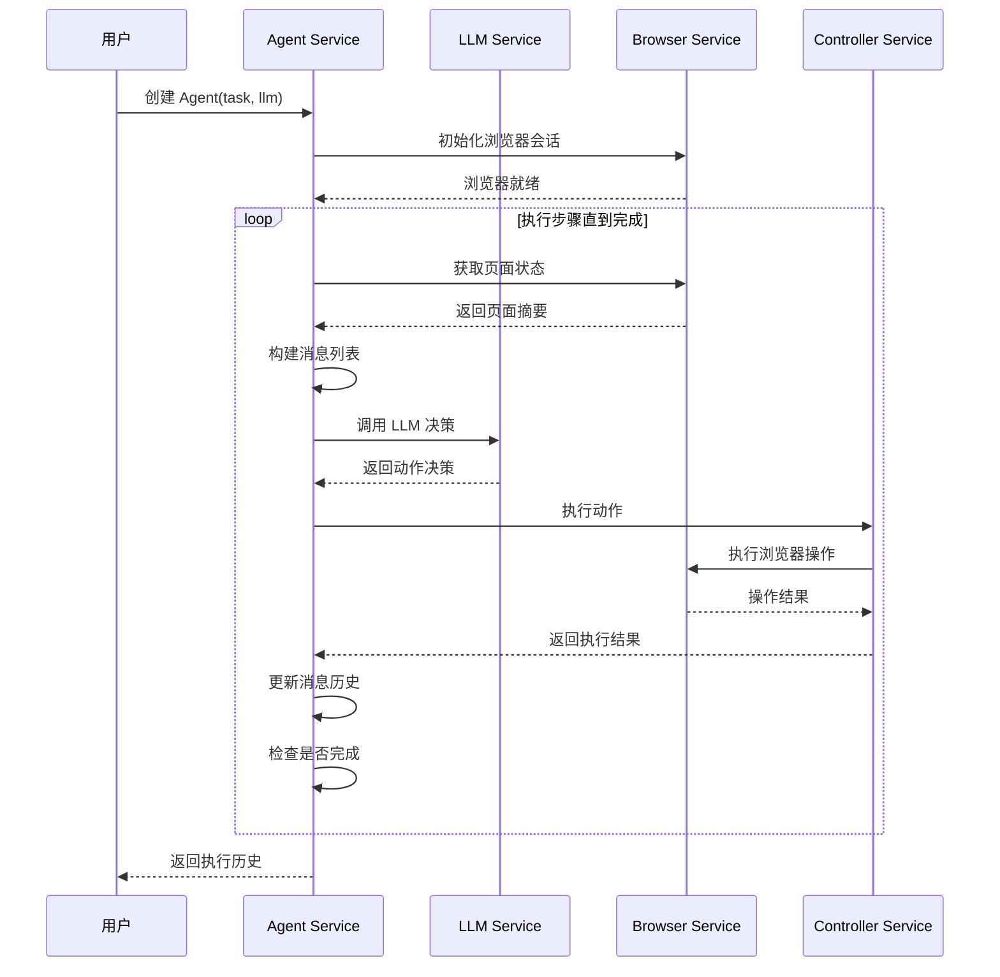
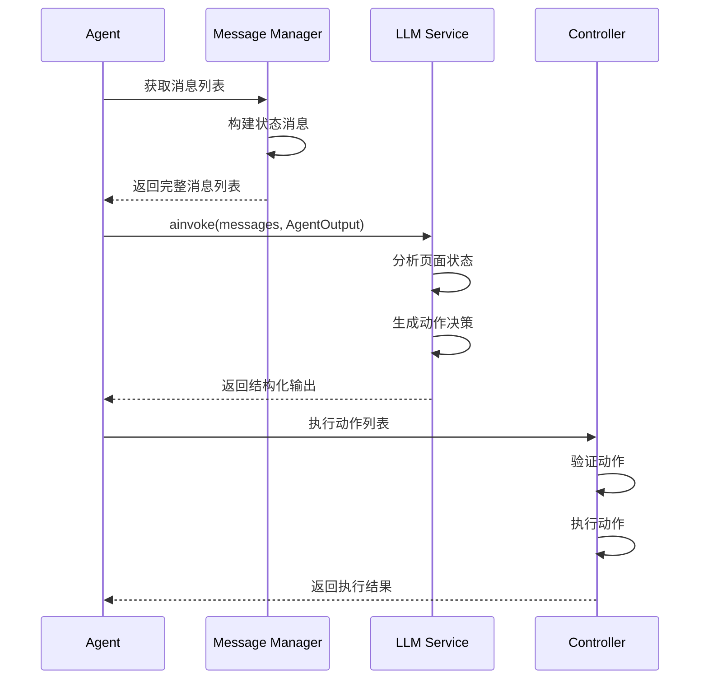
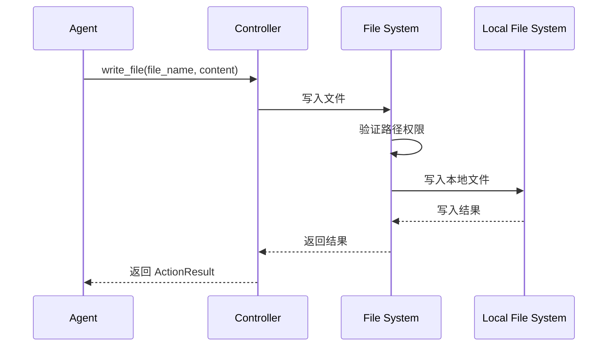

# Browser-Use 系统手册

## 系统概述

Browser-Use 是一个基于 AI 的自动化浏览器操作框架，采用分层架构设计，通过 LLM 驱动的决策引擎实现智能化的网页交互和数据提取。

## 系统架构

### 整体架构图

```
┌─────────────────────────────────────────────────────────────┐
│                    Browser-Use 系统架构                      │
├─────────────────────────────────────────────────────────────┤
│  用户层 (User Layer)                                        │
│  ┌─────────────┐  ┌─────────────┐  ┌─────────────┐          │
│  │   CLI       │  │   Python    │  │   Cloud     │          │
│  │  Interface  │  │   Library   │  │   API       │          │
│  └─────────────┘  └─────────────┘  └─────────────┘          │
├─────────────────────────────────────────────────────────────┤
│  应用层 (Application Layer)                                 │
│  ┌─────────────┐  ┌─────────────┐  ┌─────────────┐          │
│  │    Agent    │  │ Controller  │  │ Message     │          │
│  │   Service   │  │  Service    │  │ Manager     │          │
│  └─────────────┘  └─────────────┘  └─────────────┘          │
├─────────────────────────────────────────────────────────────┤
│  核心层 (Core Layer)                                        │
│  ┌─────────────┐  ┌─────────────┐  ┌─────────────┐          │
│  │    LLM      │  │   Browser   │  │   File      │          │
│  │   Service   │  │   Service   │  │   System    │          │
│  └─────────────┘  └─────────────┘  └─────────────┘          │
├─────────────────────────────────────────────────────────────┤
│  基础设施层 (Infrastructure Layer)                          │
│  ┌─────────────┐  ┌─────────────┐  ┌─────────────┐          │
│  │  Playwright │  │   OpenAI    │  │   File      │          │
│  │   Engine    │  │    API      │  │   I/O       │          │
│  └─────────────┘  └─────────────┘  └─────────────┘          │
└─────────────────────────────────────────────────────────────┘
```

### 分层详解

#### 1. 用户层 (User Layer)
- **CLI Interface**: 命令行界面，提供快速任务执行
- **Python Library**: 核心库，支持编程式调用
- **Cloud API**: 云端服务接口，支持远程执行

#### 2. 应用层 (Application Layer)
- **Agent Service**: 核心代理服务，协调整个执行流程
- **Controller Service**: 动作控制器，管理可执行操作
- **Message Manager**: 消息管理器，处理 LLM 对话

#### 3. 核心层 (Core Layer)
- **LLM Service**: 大语言模型服务，提供 AI 决策能力
- **Browser Service**: 浏览器服务，管理页面交互
- **File System**: 文件系统，处理数据存储

#### 4. 基础设施层 (Infrastructure Layer)
- **Playwright Engine**: 浏览器自动化引擎
- **OpenAI API**: AI 模型接口
- **File I/O**: 文件操作接口

## 核心组件详解

### Agent Service

```python
class Agent:
    """核心代理类，负责协调整个执行流程"""
    
    def __init__(self, task: str, llm: BaseChatModel, ...):
        # 初始化组件
        self.task = task
        self.llm = llm
        self.controller = Controller()
        self.message_manager = MessageManager()
        self.browser_session = BrowserSession()
        
    async def step(self) -> None:
        """执行单个步骤"""
        # 1. 获取页面状态
        browser_state = await self.browser_session.get_state_summary()
        
        # 2. 构建消息
        messages = self.message_manager.get_messages()
        
        # 3. 调用 LLM 决策
        model_output = await self.llm.ainvoke(messages, self.AgentOutput)
        
        # 4. 执行动作
        result = await self.controller.act(model_output.action)
        
        # 5. 更新状态
        self.message_manager.add_state_message(browser_state, model_output, result)
```

### Controller Service

```python
class Controller:
    """动作控制器，管理所有可执行的操作"""
    
    def __init__(self):
        self.registry = ActionRegistry()
        
    async def act(self, action: ActionModel) -> ActionResult:
        """执行动作"""
        # 1. 验证动作
        validated_action = self.validate_action(action)
        
        # 2. 查找处理器
        handler = self.registry.get_handler(validated_action.type)
        
        # 3. 执行动作
        result = await handler.execute(validated_action)
        
        # 4. 返回结果
        return ActionResult(
            extracted_content=result.content,
            error=result.error,
            include_in_memory=result.include_in_memory
        )
```

### Message Manager

```python
class MessageManager:
    """消息管理器，处理与 LLM 的对话"""
    
    def __init__(self):
        self.state = MessageManagerState()
        
    def get_messages(self) -> list[BaseMessage]:
        """获取当前消息列表"""
        messages = []
        
        # 1. 添加系统消息
        messages.append(SystemMessage(content=self.get_system_prompt()))
        
        # 2. 添加历史消息
        messages.extend(self.state.history.messages)
        
        # 3. 添加当前状态消息
        messages.append(self.create_state_message())
        
        return messages
        
    def create_state_message(self) -> UserMessage:
        """创建状态消息"""
        content = []
        
        # 添加文本描述
        content.append(ContentText(text=self.get_state_description()))
        
        # 添加截图（如果启用）
        if self.settings.use_vision:
            screenshot = self.take_screenshot()
            content.append(ContentImage(image_url=screenshot))
            
        return UserMessage(content=content)
```

## 核心时序图

### 主要执行流程



### LLM 决策流程



### 文件系统操作流程



## 关键技术点

### 1. 流程编排 (Flow Orchestration)

#### 核心循环机制
```python
async def run(self, max_steps: int = 100) -> AgentHistoryList:
    """主执行循环"""
    for step in range(max_steps):
        # 1. 执行单步
        await self.step()
        
        # 2. 检查是否完成
        if self.state.history.is_done():
            break
            
        # 3. 检查失败次数
        if self.state.consecutive_failures >= self.settings.max_failures:
            break
    
    return self.state.history
```

#### 状态管理
```python
class AgentState:
    """Agent 状态管理"""
    def __init__(self):
        self.n_steps = 0
        self.consecutive_failures = 0
        self.history = AgentHistoryList()
        self.last_model_output = None
        self.last_result = None
```

### 2. Prompt 工程

#### 系统提示词结构
```python
def get_system_prompt(self) -> str:
    """生成系统提示词"""
    prompt = f"""
    You are an AI agent designed to operate in an iterative loop to automate browser tasks.
    
    Your ultimate goal is accomplishing the task provided in <user_request>.
    
    Available actions:
    {self.controller.registry.get_prompt_description()}
    
    Task: {self.task}
    
    Instructions:
    1. Analyze the current page state
    2. Decide the next action(s) to take
    3. Execute actions and observe results
    4. Continue until task completion
    """
    return prompt
```

#### 状态消息格式
```python
def create_state_message(self) -> UserMessage:
    """创建状态消息"""
    content = f"""
    <agent_state>
    <user_request>
    {self.task}
    </user_request>
    
    <file_system>
    {self.file_system.get_description()}
    </file_system>
    
    <current_page>
    URL: {self.browser_session.current_page.url}
    Title: {self.browser_session.current_page.title}
    Interactive Elements: {len(self.browser_state.selector_map)}
    </current_page>
    
    <screenshot>
    [Base64 encoded screenshot]
    </screenshot>
    </agent_state>
    """
    return UserMessage(content=content)
```

### 3. 动作注册机制

#### 动作注册器
```python
class ActionRegistry:
    """动作注册器"""
    
    def __init__(self):
        self.actions = {}
        
    def register_action(self, name: str, handler: Callable):
        """注册动作"""
        self.actions[name] = handler
        
    def get_handler(self, action_type: str) -> Callable:
        """获取动作处理器"""
        return self.actions.get(action_type)
        
    def get_prompt_description(self) -> str:
        """生成动作描述"""
        descriptions = []
        for name, handler in self.actions.items():
            descriptions.append(f"- {name}: {handler.__doc__}")
        return "\n".join(descriptions)
```

#### 内置动作示例
```python
@controller.registry.action("Navigate to URL")
async def go_to_url(url: str, new_tab: bool = False):
    """Navigate to a specific URL"""
    if new_tab:
        await browser_session.new_tab()
    await browser_session.goto(url)
    return ActionResult(extracted_content=f"Navigated to {url}")

@controller.registry.action("Click element by index")
async def click_element_by_index(index: int):
    """Click an element by its index in the page"""
    element = await browser_session.click_element_by_index(index)
    return ActionResult(extracted_content=f"Clicked element {index}")
```

### 4. 错误处理和重试机制

#### 错误处理策略
```python
async def _handle_step_error(self, error: Exception) -> list[ActionResult]:
    """处理步骤错误"""
    self.state.consecutive_failures += 1
    
    if isinstance(error, ValidationError):
        # 模型输出验证错误
        return [ActionResult(error="Invalid model output", include_in_memory=True)]
    elif isinstance(error, BrowserError):
        # 浏览器操作错误
        return [ActionResult(error="Browser operation failed", include_in_memory=True)]
    else:
        # 其他错误
        return [ActionResult(error=str(error), include_in_memory=True)]
```

#### 重试机制
```python
async def get_next_action(self, messages: list[BaseMessage]) -> AgentOutput:
    """获取下一个动作，支持重试"""
    max_retries = 3
    
    for attempt in range(max_retries):
        try:
            response = await self.llm.ainvoke(messages, self.AgentOutput)
            return response.completion
        except Exception as e:
            if attempt == max_retries - 1:
                raise e
            # 添加重试提示
            messages.append(UserMessage(content="Please retry with a valid action format."))
```

### 5. 文件系统沙箱

#### 沙箱机制
```python
class FileSystem:
    """文件系统沙箱"""
    
    def __init__(self, root_path: str = None):
        self.root_path = root_path or self._get_temp_path()
        
    def write_file(self, file_name: str, content: str) -> str:
        """写入文件到沙箱"""
        # 验证文件名
        if not self._is_valid_filename(file_name):
            raise ValueError("Invalid filename format")
            
        # 构建完整路径
        full_path = os.path.join(self.root_path, file_name)
        
        # 确保路径在沙箱内
        if not self._is_path_safe(full_path):
            raise ValueError("Path outside sandbox")
            
        # 写入文件
        with open(full_path, 'w', encoding='utf-8') as f:
            f.write(content)
            
        return full_path
```

### 6. 视觉理解集成

#### 截图处理
```python
async def take_screenshot(self) -> str:
    """获取页面截图"""
    screenshot_bytes = await self.browser_session.take_screenshot()
    screenshot_base64 = base64.b64encode(screenshot_bytes).decode()
    return f"data:image/png;base64,{screenshot_base64}"

def create_vision_message(self, screenshot: str) -> UserMessage:
    """创建包含视觉信息的消息"""
    content = [
        ContentText(text="Current page state:"),
        ContentImage(image_url=screenshot)
    ]
    return UserMessage(content=content)
```

## 性能优化

### 1. 缓存机制
- **LLM 响应缓存**：缓存相同的 LLM 请求
- **页面状态缓存**：缓存页面元素信息
- **文件系统缓存**：缓存文件读取结果

### 2. 并发处理
- **异步执行**：所有 I/O 操作都是异步的
- **批量操作**：支持一次执行多个动作
- **并行 Agent**：支持多个 Agent 并行执行

### 3. 资源管理
- **浏览器连接池**：复用浏览器实例
- **内存优化**：及时清理不需要的数据
- **超时控制**：设置合理的超时时间

## 安全机制

### 1. 域名限制
```python
browser_session = BrowserSession(
    allowed_domains=["trusted-site.com"],
    blocked_domains=["malicious-site.com"]
)
```

### 2. 文件系统隔离
```python
file_system = FileSystem(
    root_path="/safe/directory",
    read_only_paths=["/readonly"],
    write_allowed_paths=["/writable"]
)
```

### 3. 敏感数据处理
```python
agent = Agent(
    sensitive_data={
        "api_key": "***",
        "password": "***"
    },
    sensitive_data_domains=["api.example.com"]
)
```

## 监控和调试

### 1. 日志系统
```python
import logging

# 配置日志级别
logging.basicConfig(level=logging.DEBUG)

# 启用详细日志
os.environ['BROWSER_USE_LOGGING_LEVEL'] = 'debug'
```

### 2. 性能监控
```python
# Token 使用统计
token_summary = await agent.token_cost_service.get_usage_summary()
print(f"Total tokens: {token_summary.total_tokens}")
print(f"Total cost: ${token_summary.total_cost}")

# 执行时间统计
execution_time = agent.state.history.total_duration_seconds()
print(f"Execution time: {execution_time}s")
```

### 3. 状态追踪
```python
# 保存执行历史
agent = Agent(
    save_conversation_path="./conversations",
    generate_gif=True
)
```

## 扩展开发

### 1. 自定义动作
```python
@controller.registry.action("Custom Action")
async def custom_action(param1: str, param2: int):
    """自定义动作实现"""
    result = await external_api_call(param1, param2)
    return ActionResult(
        extracted_content=result,
        include_in_memory=True
    )
```

### 2. 自定义 LLM
```python
class CustomLLM(BaseChatModel):
    """自定义 LLM 实现"""
    
    async def ainvoke(self, messages: list[BaseMessage], output_format=None):
        # 实现自定义 LLM 调用逻辑
        response = await self._call_custom_api(messages)
        return ChatInvokeCompletion(
            completion=response,
            usage=self._get_usage(response)
        )
```

### 3. 自定义浏览器
```python
class CustomBrowserSession(BrowserSession):
    """自定义浏览器会话"""
    
    async def custom_navigation(self, url: str):
        """自定义导航逻辑"""
        # 实现自定义导航
        pass
```

## 总结

Browser-Use 通过分层架构设计，实现了 AI 驱动的浏览器自动化。核心在于：

1. **Agent 协调**：统一管理执行流程
2. **LLM 决策**：智能分析页面状态并决策
3. **动作执行**：标准化的浏览器操作接口
4. **状态管理**：完整的执行状态追踪
5. **安全隔离**：多层次的安全保护机制

这种架构设计使得系统既灵活可扩展，又安全可靠，能够满足各种复杂的自动化需求。 